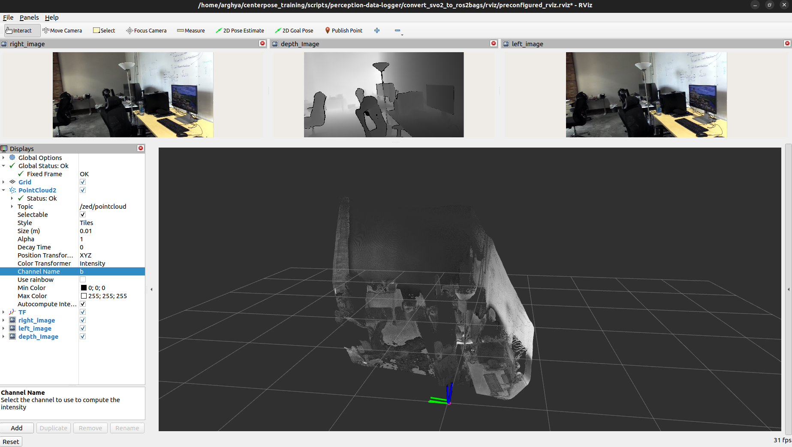
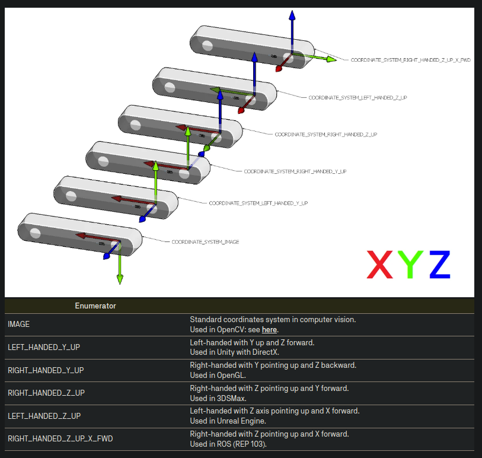
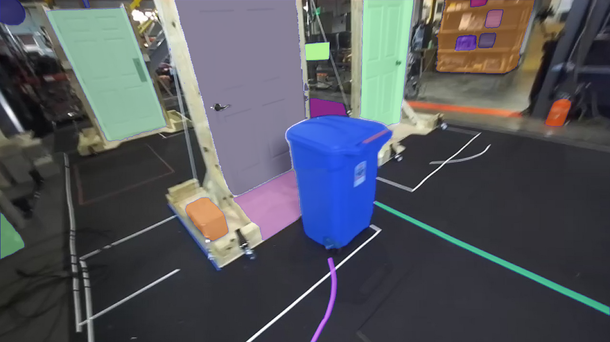
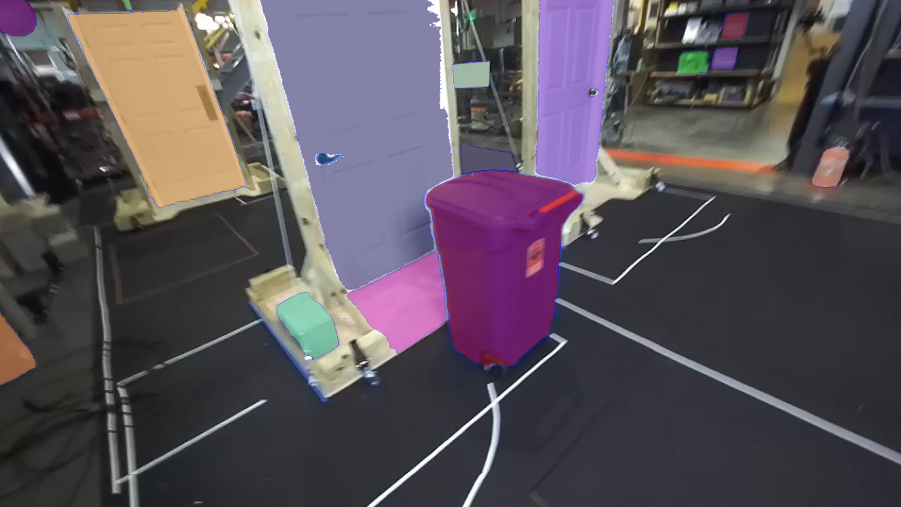
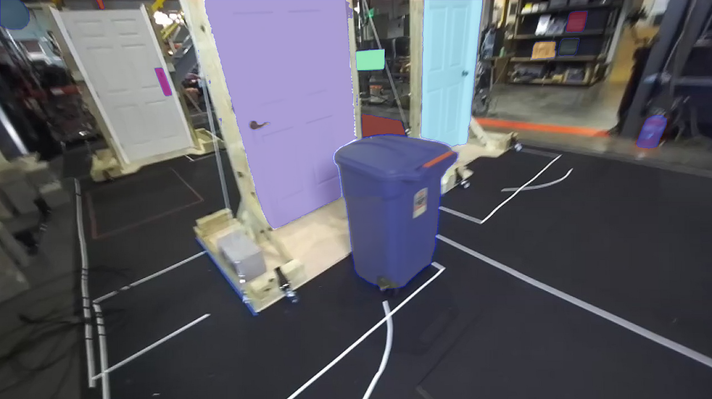
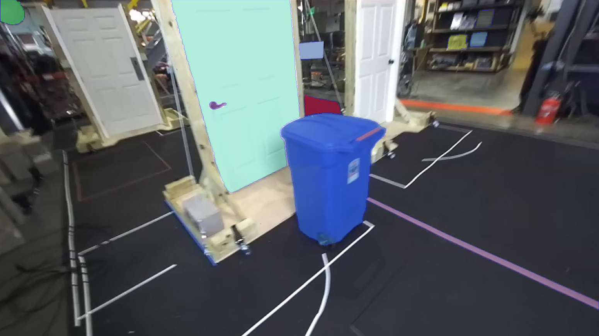

# All-About-Github-Readme
This repository is all about instructions for writing good github readmes. 

## How to make the github readme title centered ?
  
Answer:

Center your tittle like this:

<div align="center">
 <h1>Center Your Readme Title</h1>
</div>

## How to add 2 photos side by side in the readme ?
  
Answer:

<div align="center">
  
  
</div>

## How to add 4 photos in 2 rows in the readme ?

Answer:

<table>
  <tr>
    <td>
      <figure>
        
        <figcaption>sam2_l</figcaption>
      </figure>
    </td>
    <td>
      <figure>
        
        <figcaption>sam2_s</figcaption>
      </figure>
    </td>
  </tr>
  <tr>
    <td>
      <figure>
        
        <figcaption>sam2_b+</figcaption>
      </figure>
    </td>
    <td>
      <figure>
        
        <figcaption>sam2_t</figcaption>
      </figure>
    </td>
  </tr>
</table>

## How to embed youtube link in the readme with thumbnails ?

Answer:

<p align="center">
  <a href="https://www.youtube.com/watch?v=OIrF6zDRH64" target="_blank">
    
  </a>
</p>

## How to embed google drive link in the readme with a thumbnail ?

Answer:

[](https://drive.google.com/file/d/1gTQt6soSIq1g2QmK7locHDiZ-8MqVl2w/view?usp=sharing) 

## How to add a table in the readme ?

Answer:

## How to hide something in the readme?

Answer:
<details>
  <summary>Show data folder structure</summary>
  
```
├── hm3dsem_walks
│   ├── val
│   │   ├── 00824-Dd4bFSTQ8gi
│   │   │   ├── depth
│   │   │   │   ├── Dd4bFSTQ8gi-000000.png
│   │   │   │   ├── ...
│   │   │   ├── rgb
│   │   │   │   ├── Dd4bFSTQ8gi-000000.png
│   │   │   │   ├── ...
│   │   │   ├── semantic
│   │   │   │   ├── Dd4bFSTQ8gi-000000.png
│   │   │   │   ├── ...
│   │   │   ├── pose
│   │   │   │   ├── Dd4bFSTQ8gi-000000.png
│   │   │   │   ├── ...
|   |   ├── 00829-QaLdnwvtxbs
|   |   ├── ..
├── Replica
│   ├── office0
│   │   ├── results
│   │   │   ├── depth0000.png
│   │   │   ├── ...
│   │   |   ├── rgb0000.png
│   │   |   ├── ...
│   │   ├── traj.txt
│   ├── office1
│   ├── ...
├── ScanNet
│   ├── scans
│   │   ├── scene0011_00
│   │   │   ├── color
│   │   │   │   ├── 0.jpg
│   │   │   │   ├── ...
│   │   │   ├── depth
│   │   │   │   ├── 0.png
│   │   │   │   ├── ...
│   │   │   ├── poses
│   │   │   │   ├── 0.txt
│   │   │   │   ├── ...
│   │   │   ├── internsics
│   │   │   │   ├── intrinsics_color.txt
│   │   │   │   ├── intrinsics_depth.txt
│   │   ├── ..
```

</details>

